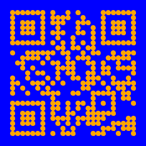

qrcode-other-pattern
====================

This `Segno <https://github.com/heuer/segno>`_ plugin can change the QR code's black modules into your own shapes instead of squares.

Recommended Custom Image
========================

A black image with a transparent background.

Installing Through PyPi
=======================
::

    pip3 install qrcode-other-pattern

Using the library
=================
::

    import segno

    qr_code = segno.make('https://ferdinandsilva.com')
    new_pattern = qr_code.to_other_pattern(scale=10, border=2, file_pattern='pattern.png', dark='orange', light='blue')
    new_pattern.save('example.png')